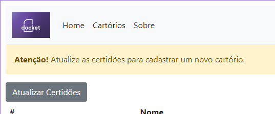
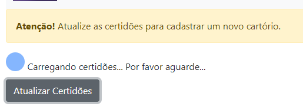
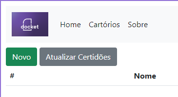

## Java Docket Test
Neste teste para a área de desenvolvedor Backend, à partir do briefing e requisito apresentados, a Docket propõe a você construir um sistema de cartórios e o planejamento do seu projeto.

### Tecnologias Utilizadas

- Java 8 (ou superior) ✔️
- Spring Boot ✔️
- Thymeleaf HTML ✔️
- Banco de dados H2DB ✔️

### Fluxo Cartório:

### Sistema de Cartórios:

#### Obs.: fluxo e caso de usos criados via Creatly

### Consumo da API da Docket - Certidões
#### Para criar um cenário onde houvesse o consumo da API no teste, pensei em introduzir um fluxo de atualização de certidões para reproduzir o caso de uso desenhado acima. 
#### Como a requisição por vezes variava o tempo despendido para obter a resposta, talvez não ficaria interessante consumir ela toda vez que fosse necessário cadastrar um novo cartório. Principalmente se a frequência de atualização desta lista não fosse tão grande.

#### Com base nesta premissa, optei por desenvolver um mecanismo onde o sistema consultasse a API e persistisse as informações no banco de dados local, para então poder utilizarmos nos cadatros de cartórios.
#### Uma vez tendo as informações localmente, ficaria mais performático para o cadastro.

#### Ao atualizar as certidões, o sistema libera a opção para cadastrar um novo cartório.

#### E a funcionalidade "**Atualizar Certidões**" fica sempre disponível para que as mesmas sejam atualizadas caso houver necessidade (poderia até ser programado de tempos em tempos para rodar este processo).
#### obs.: a verificação se a certidão é nova foi feita pelo "id"

### Client API Rest
#### O client interno ficou desenvolvido na classe "RegistryOfficeApiController", com o prefixo "api/" nas rotas. 
#### Confesso que não sabia se era o melhor cenário dentro da arquitetura do Java Spring Boot, mas foi o que encontrei mais sentido na hora de desenvolver.

## Considerações Finais
- Tenho consciência de que é possível melhorar muita coisa referente a template engine, mas por ser o primeiro contato foi bastante interessante explorar o Thymeleaf!
- O mesmo vale para o Java em si (igualmente o Spring Boot). Encontrei algumas similaridades com o PHP/Laravel, mas no geral foi bem legal e um grande aprendizado!
- Pretendo posteriormente adicionar testes unitários no projeto para ver como funcionam no Spring Boot.
- O tempo médio usado para desenvolver o teste foi de aproximadamente 16h ~ 18h.
- Agradeço muito pela oportunidade!
